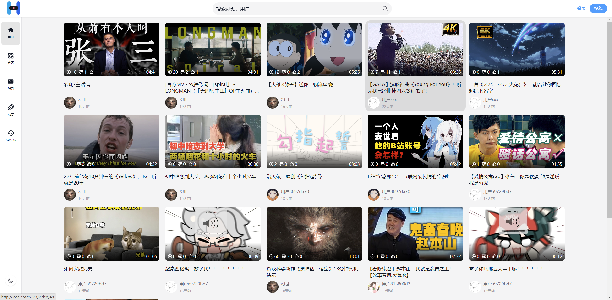

# Huan Video Front

Huan Video Front 是幻视视频平台的前端项目，基于 Vue 3、TypeScript 和 Vite 构建，提供视频浏览、播放、弹幕、评论、搜索、个人空间、消息私信、创作中心和审核管理等页面。



## 功能特性

- 首页视频流、分类页、搜索页和推荐列表
- 视频详情页，集成 ArtPlayer、HLS 播放、弹幕展示与发送
- 登录、注册、用户信息维护、头像裁剪和密码修改
- 点赞、收藏、投币、关注、评论和播放历史
- 个人空间、动态、消息中心和私信聊天
- 创作中心：视频投稿、稿件管理、评论管理、弹幕管理
- 审核管理：视频审核列表和审核详情
- 明暗主题切换，Pinia 状态持久化

## 技术栈

- Vue 3 + TypeScript + Vite
- Vue Router + Pinia + pinia-plugin-persistedstate
- Element Plus + Tailwind CSS + Sass
- Axios
- ArtPlayer + HLS.js + artplayer-plugin-danmuku
- Socket.IO Client
- cropper-next-vue

## 环境要求

- Node.js 18+
- pnpm 8+
- 后端服务 `huan-video` 已启动

## 快速开始

```bash
pnpm install
pnpm dev
```

默认 Vite 服务会监听 `0.0.0.0`，并自动打开浏览器。

## 环境变量

可以在项目根目录创建 `.env.development`：

```env
VITE_BASE_API=/api/v1
VITE_BASE_API_URL=http://localhost:8091
VITE_SOCKET_URL=http://localhost:7000
```

说明：

- `VITE_BASE_API`：前端请求前缀，默认 `/api/v1`
- `VITE_BASE_API_URL`：Vite 开发代理转发的后端地址，默认 `http://localhost:8091`
- `VITE_SOCKET_URL`：Socket.IO 服务地址，默认 `http://localhost:7000`

## 常用命令

```bash
pnpm dev        # 启动开发环境
pnpm build      # 构建生产包
pnpm preview    # 本地预览构建产物
pnpm typecheck  # TypeScript 类型检查
```

## 目录结构

```text
huan-video-front
├─ src
│  ├─ api             # 接口封装
│  ├─ assets          # 静态资源
│  ├─ components      # 通用组件
│  ├─ composables     # 组合式逻辑
│  ├─ layout          # 前台基础布局
│  ├─ router          # 路由配置
│  ├─ stores          # Pinia 状态管理
│  ├─ style           # 全局样式
│  ├─ types           # TypeScript 类型
│  ├─ utils           # 工具函数、请求和 WebSocket
│  └─ views           # 页面视图
├─ public
├─ vite.config.ts
└─ package.json
```

## 页面入口

- `/`：首页


- `/video/:id`：视频详情


- `/category`：视频分类(未完成)

- `/search`：搜索


- `/history`：观看历史


- `/space/:uid?`：用户空间


- `/message/whisper/:mid?`：私信


- `/account/setting`：账号设置


- `/platform/upload/video`：投稿


- `/platform/upload-manager/article`：稿件管理


- `/platform/interaction/comment`：评论管理


- `/platform/interaction/barrage`：弹幕管理


- `/platform/audit/video`：视频审核
